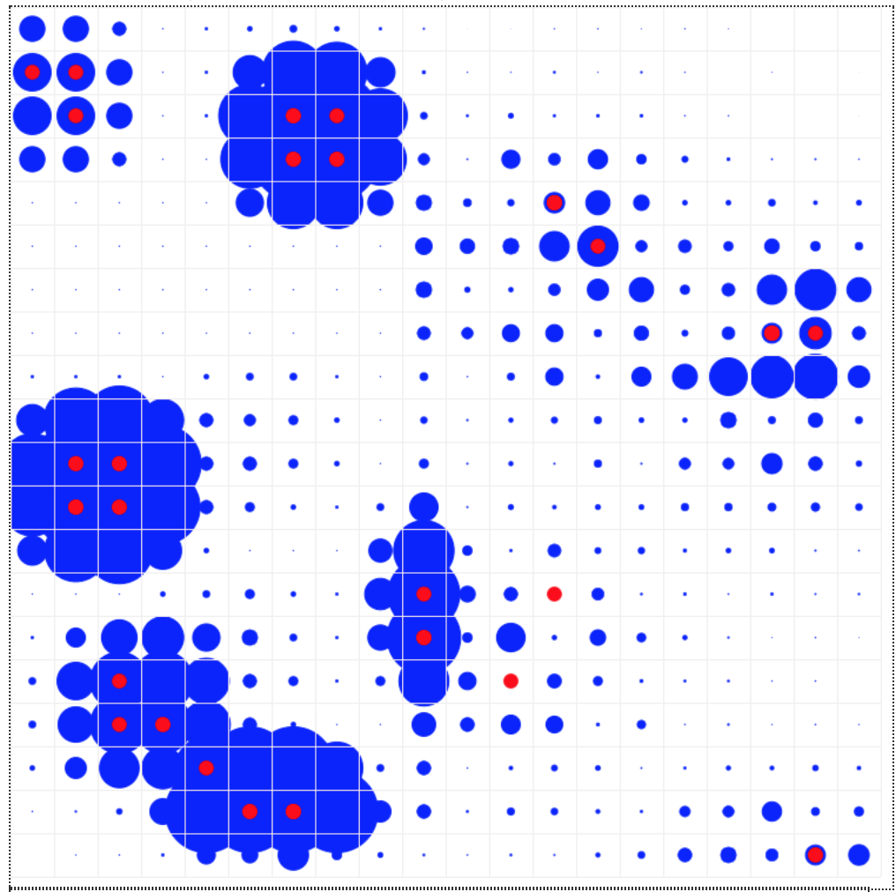

# Slime Mold Aggregation Model
*An agent-based model of unicellular/multicellular behavior transitions mediated by a chemical messenger.*
## Summary
Slime molds are a group of protist species that can live freely as unicellular organisms or aggregate to form multicellular structures. Most slime molds spend the majority of their life cycle in their single-cell state. When nutrient limited, cells of a single species can congregate as a single cohesive unit. The molds can adapt their shape, size, and function. When acting in a multicellular fashion, slime molds can release spores into the air. Slime molds are heterotrophs and graze on smaller microorganisms such as bacteria and fungi. These organisms use cyclic adenosine monophosphate (cAMP) as a messaging molecule. Within an aggregate, modulation of cAMP leads to a complex array of behavior. The unique “bottom-up” self-organizing behavior of slime molds is interesting as a study of decentralized control systems. Similar to stigmergy in insects, there is no central controller of slime mold action e.g. ant foraging, honeybee swarm modulation, etc. While the individual agents in the insect models are obligated to community lifestyle, slime molds spend a minority of their time [if any] as a superorganism: individual protists are ultimately self-sufficient.

## Model Description



### Agents
There are two flavors of agent used in this model: chemicals and slime cells.

**Chemicals**
Chemicals are defined as a class, `ChemAgent`. They use class methods `evaporate` and `diffuse` to modify their chemical concentrations. Instants of the ChemAgent class are distributed uniformly across the model arena - their only purpose is to record the chemical concentration in their respective grid space. ChemAgents do not move but share their currency `self.chem` with their neighbors: this represents chemical diffusion.

**Slimes**
Slime cells are defined as a class, `SlimeAgent`. Objects of this class use methods `move()` and `secrete()` to follow chemical gradients and disperse chemical, respectively. The `move()` method allows the agent to identify the neighboring grid space with highest chemical concentration and move there.

### Model
The model is defined as a class `SlimeModel` that takes arguments `pop`, `width` and `height`: `pop` represents the number of slime cells to populate. Width and height define the grid dimensions.

The model spawns agents in the following fashion:
1. For every grid coordinate that exists, ChemAgents are instantiated and placed.
2. For the value of `pop`, SlimeAgents are instantiated. These are placed at random locations in the grid space.

The model uses the mesa datacollector function to report the total amount of chemical in the model arena. `compute_total_chemical()` is the global method responsible for this.

### Visualization, Server
To visualize and interact with the model, `run.py` should be run from the command line. This file contains portrayal methods for each agent, model-level parameters (can be modified by user), visualization parameters, and server information. The port used is `server.port = 8251 # the default port`.

## Installation
This model's dependencies can be installed with pip and the `requirements.txt` document contained in this repository

```
$ pip install -r requirements.txt
```

## Usage
To run the model interactively in your browser, use

```
$ python run.py
```

In a browser window, navigate to [http://127.0.0.1:8521/](http://127.0.0.1:8521/), press Reset, then Run.

## References
1.	Wilensky, U. (1997). NetLogo Slime model. http://ccl.northwestern.edu/netlogo/models/Slime. Center for Connected Learning and Computer-Based Modeling, Northwestern University, Evanston, IL.
2.	Wilensky, U. (1999). NetLogo. http://ccl.northwestern.edu/netlogo/. Center for Connected Learning and Computer-Based Modeling, Northwestern University, Evanston, IL.
3.	Mesa: Agent-based modeling in Python 3+ https://github.com/projectmesa/mesa
